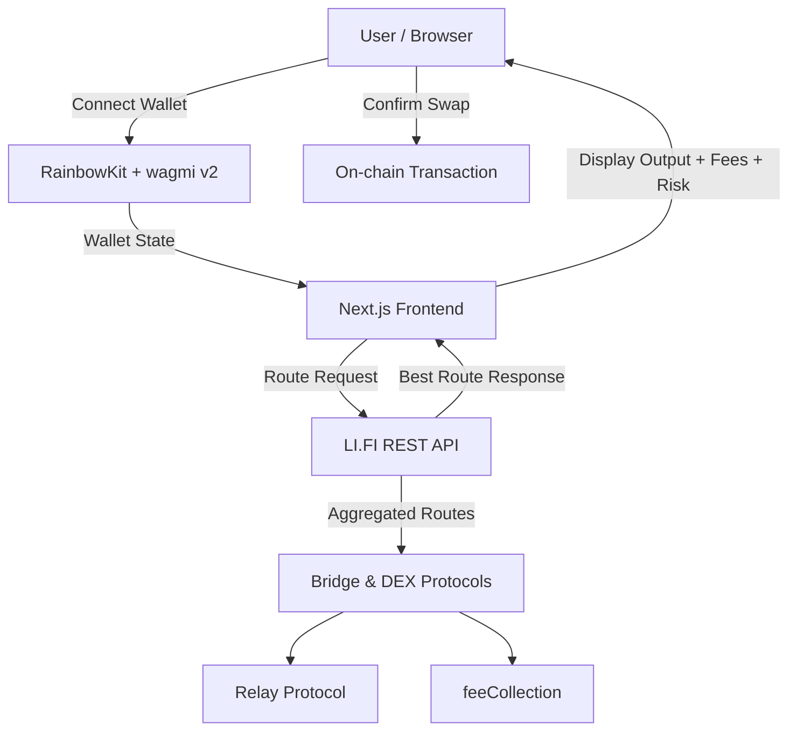
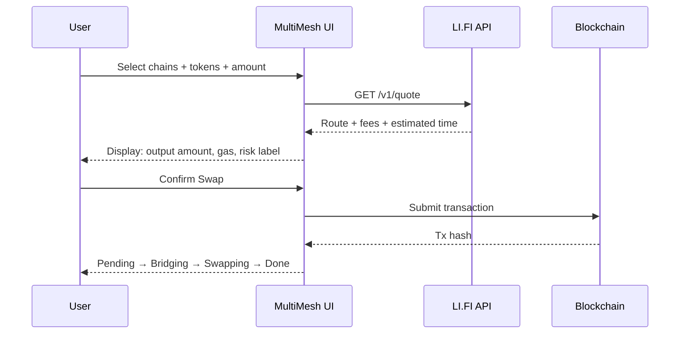

<div align="center">
  <h1>⬡ MULTIMESH</h1>
  <p><strong>Cross-chain exchange aggregator — swap any token across any chain in a single flow</strong></p>

  <p>
    <a href="https://multimesh.vercel.app"></a>
    
    
    
    
  </p>
</div>

---

## The Problem

Moving assets between blockchains today means juggling multiple bridges, switching wallets, and executing several transactions manually. It's slow, error-prone, and requires technical knowledge most users don't have.

## The Solution

MultiMesh abstracts all of that. Connect your wallet, pick your source and destination chain, enter an amount — and get the best available route with real-time fees, execution time, and risk level. One click. Done.

**Live:** [multimesh.vercel.app](https://multimesh.vercel.app)

---

## Table of Contents

- [Architecture](#architecture)
- [User Flow](#user-flow)
- [Tech Stack](#tech-stack)
- [Repo Structure](#repo-structure)
- [Getting Started](#getting-started)
- [Supported Networks](#supported-networks)
- [Roadmap](#roadmap)
- [Contributing](#contributing)
- [License](#license)

---

## Architecture





---

## User Flow

```
1. Connect wallet (MetaMask / WalletConnect)
        ↓
2. Select source chain + token + amount
        ↓
3. Select destination chain + token
        ↓
4. Click "Find Best Route"
        ↓
5. System fetches routes from LI.FI API
   → Best route displayed with:
     - Output amount
     - Fee ($)
     - Execution time
     - Risk label (Low / Medium / High)
        ↓
6. User confirms swap
        ↓
7. Transaction tracked:
   Pending → Bridging → Swapping → Done
```

---

## Tech Stack

| Layer | Technology |
|---|---|
| Framework | [Next.js 14](https://nextjs.org) (App Router) |
| Styling | [Tailwind CSS](https://tailwindcss.com) |
| Wallet Connection | [wagmi v2](https://wagmi.sh) + [RainbowKit](https://rainbowkit.com) |
| Cross-chain Routing | [LI.FI REST API](https://docs.li.fi) |
| Blockchain Utilities | [ethers.js v6](https://docs.ethers.org) + [viem](https://viem.sh) |
| State Management | [TanStack Query v5](https://tanstack.com/query) |
| Deployment | [Vercel](https://vercel.com) |
| Language | TypeScript |

---

## Repo Structure

```
multimesh/
├── src/
│   ├── app/
│   │   ├── layout.tsx       # Root layout + metadata
│   │   ├── page.tsx         # Entry page
│   │   └── globals.css      # Global styles
│   ├── components/
│   │   ├── SwapInterface.tsx # Main swap card + route display + tx modal
│   │   ├── TxSimulation.tsx  # Transaction status simulation
│   │   └── Providers.tsx    # wagmi + RainbowKit + TanStack providers
│   └── lib/
│       ├── lifi.ts          # LI.FI API integration + route fetching
│       └── wagmi.ts         # Chain config + supported tokens
├── next.config.mjs
├── tailwind.config.ts
├── tsconfig.json
└── package.json
```

---

## Getting Started

**Requirements:** Node.js 18+, npm

```bash
git clone https://github.com/kurzmichael02-hue/multimesh
cd multimesh
npm install
npm run dev
```

Open [http://localhost:3000](http://localhost:3000)

---

## Supported Networks (MVP)

| Network | Chain ID | Native Token |
|---|---|---|
| Ethereum | 1 | ETH |
| Polygon | 137 | MATIC |
| BNB Chain | 56 | BNB |

Supported tokens per chain: ETH, USDC, USDT, WBTC, MATIC, BNB

---

## Roadmap

- [x] Wallet connection (MetaMask + WalletConnect)
- [x] Cross-chain route fetching via LI.FI
- [x] Real-time fees, execution time, risk labels
- [x] Transaction simulation (Pending → Bridging → Swapping → Done)
- [x] Deployed on Vercel
- [ ] Real on-chain swap execution
- [ ] Arbitrum, Optimism, Base support
- [ ] Gas abstraction
- [ ] MEV protection
- [ ] Public API / SDK for developers

---

## Contributing

Pull requests are welcome. For major changes, open an issue first.

Branch convention:
- `feat/` — new features
- `fix/` — bug fixes
- `docs/` — documentation only

Commit style: `feat: add route comparison`, `fix: lifi endpoint 404`, `docs: update architecture diagram`

---

## License

MIT
